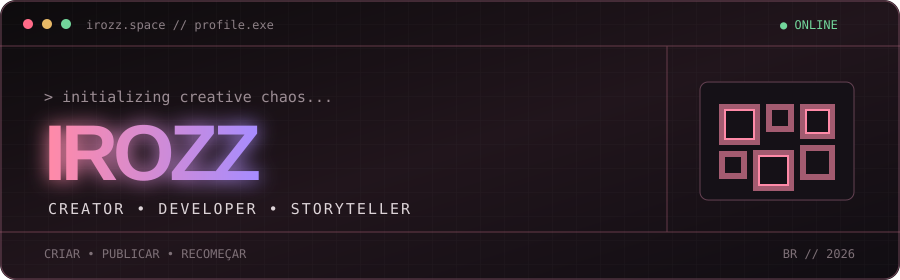

<div align="center">
  
</div>

<div align="center">
  <a href="https://irozz.space/"></a>
  <a href="https://www.youtube.com/@RatinYT0"></a>
  <a href="https://www.instagram.com/ratinyt0/"></a>
</div>

### `> whoami`

```text
Irozz // criador, dev e contador de histórias na internet
Status: transformando ideias aleatórias em coisas que funcionam (quase sempre)
```

Faço sites com personalidade, bots para comunidades e experiências que misturam código, criatividade e um pouco de caos. Quando não estou programando, provavelmente estou criando vídeos ou explorando o VRChat.

- 🐀 Construindo bots e ferramentas para o **Stoat**
- 📼 Curtindo estética retrô, a web dos anos 2000 e interfaces diferentes
- 🥽 Jogador de SteamVR e customizador de avatares no Unity
- 🌎 Falando em português e inglês

### `> toolbox --list`

<div align="center">
  
</div>

### `> ls ./projetos`

<table>
  <tr>
    <td width="50%" valign="top">
      <h3>🌐 irozz.space</h3>
      <p>Meu universo pessoal na web: vídeos, links, setup e perfil VRChat em uma interface retrô responsiva.</p>
      <a href="https://irozz.space/">acessar transmissão →</a>
    </td>
    <td width="50%" valign="top">
      <h3>🎵 Stoat Music Bot</h3>
      <p>Bot de música em Python para canais de voz do Stoat, com fila, pause, skip e outros comandos.</p>
      <a href="https://github.com/Irozz-1/stoat-music-bot">ver repositório →</a>
    </td>
  </tr>
</table>

### `> github --stats`

<div align="center">
  
</div>

### `> snake --feed`

<div align="center">
  <picture>
    <source media="(prefers-color-scheme: dark)" srcset="https://raw.githubusercontent.com/Irozz-1/Irozz-1/output/github-snake-dark.svg" />
    <source media="(prefers-color-scheme: light)" srcset="https://raw.githubusercontent.com/Irozz-1/Irozz-1/output/github-snake.svg" />
    
  </picture>
  <br />
  <sub>Cada quadradinho foi uma ideia que virou commit.</sub>
</div>

### `> connect --open`

<div align="center">
  <a href="https://vrchat.com/home/user/usr_b2b0e3df-09d8-4ce9-8a52-79059e8fe97e">VRChat</a>
  &nbsp;•&nbsp;
  <a href="https://stt.gg/bF9669SR">Stoat</a>
  &nbsp;•&nbsp;
  <a href="https://irozz.space/">Website</a>
</div>

<br />

<div align="center">
  <sub>CRIAR • PUBLICAR • RECOMEÇAR // transmitting from irozz.space</sub>
</div>
